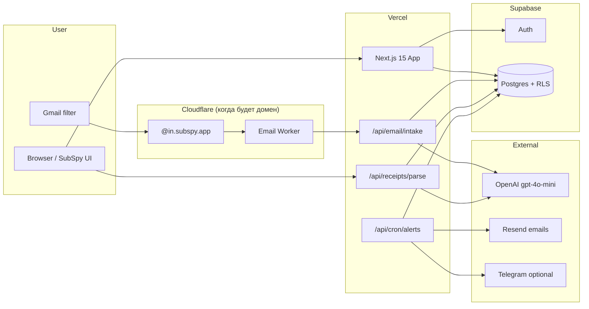
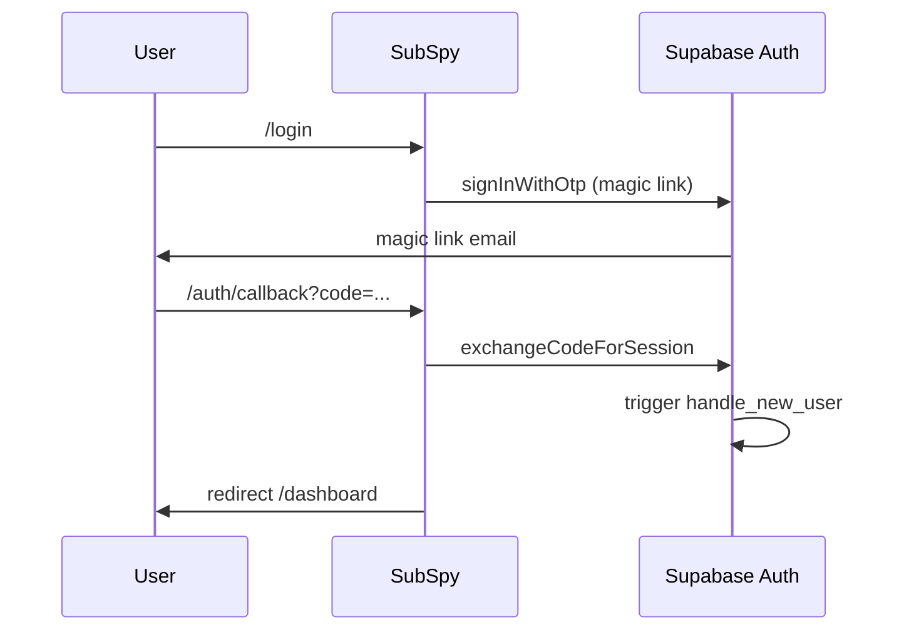

# SubSpy — Project Hub (Obsidian)

> **SubSpy** — сервис, который находит recurring-подписки из пересланных email-чеков и предупреждает о renewal до списания.
>
> **Текущая фаза:** бесплатная private beta. Бilling отключён намеренно.

---

## Быстрые ссылки

| Ресурс | URL |
|--------|-----|
| Production | https://sub-spy-kappa.vercel.app |
| GitHub | https://github.com/zobnin8-ux/SubSpy |
| Supabase Project ID | `ibyihwjlieidirnlxexm` |
| Supabase URL | https://ibyihwjlieidirnlxexm.supabase.co |
| Vercel team | `zobnin8-ux's projects` |

---

## Оглавление

- [[#Идея продукта]]
- [[#Архитектура]]
- [[#Стек]]
- [[#Структура репозитория]]
- [[#Страницы приложения]]
- [[#API routes]]
- [[#База данных Supabase]]
- [[#Dashboard и статистика]]
- [[#Auth flow]]
- [[#Email и парсинг]]
- [[#Renewal alerts]]
- [[#Beta limits]]
- [[#Environment variables]]
- [[#Деплой]]
- [[#Локальная разработка]]
- [[#Текущий статус (что работает)]]
- [[#Roadmap]]
- [[#Troubleshooting]]
- [[#Связанные документы]]
- [[#Cursor MCP интеграции]]

---

## Идея продукта

### Проблема

Мелкие recurring-списания становятся невидимыми. Пользователь не помнит, что подписка скоро продлится.

### Решение

1. Пользователь пересылает чеки на свой alias
2. Система парсит письмо (OpenAI)
3. Подписки сохраняются в dashboard
4. За 3 дня до renewal — email/Telegram alert

### Что SubSpy **не** делает (MVP)

- ❌ Banking / Plaid
- ❌ Budgeting
- ❌ AI insights / agents
- ❌ Billing (временно отключён)
- ❌ Mobile app

### Целевая аудитория

Indie hackers, developers, founders, freelancers, SaaS-heavy users. US/EU, English, USD.

---

## Архитектура



### Принципы архитектуры

- Lean, boring, understandable
- Без microservices, queues, Redis, vector DB
- Billing-ready через `canUseProduct()` в `src/lib/access.ts`

---

## Стек

| Слой | Технология |
|------|------------|
| Frontend | Next.js 15, TypeScript, Tailwind, shadcn/ui, Framer Motion |
| Backend | Supabase (Postgres, Auth, RLS) |
| Hosting | Vercel |
| Email intake | Cloudflare Email Workers (после покупки домена) |
| Parsing | OpenAI API, `gpt-4o-mini`, structured JSON |
| Alerts | Resend (+ optional Telegram) |
| Cron | Vercel Cron → `/api/cron/alerts` daily 09:00 UTC |

---

## Структура репозитория

```
SubSpy/
├── src/
│   ├── app/                    # Next.js App Router
│   │   ├── api/                # API routes
│   │   ├── auth/callback/      # Supabase OAuth callback
│   │   ├── dashboard/
│   │   ├── settings/
│   │   └── ...
│   ├── components/             # UI + receipt-tester
│   ├── lib/                    # supabase, parsing, alerts, access
│   └── middleware.ts           # Auth guard
├── supabase/
│   ├── setup_all.sql           # One-shot schema для нового проекта
│   └── migrations/             # 001, 002, 003
├── workers/email/              # Cloudflare Email Worker
├── docs/
│   ├── SubSpy.md               # ← этот файл
│   ├── SUPABASE_SETUP_RU.md
│   ├── SubSpy_Full_Technical_Specification.md
│   └── SubSpy_Remove_Billing_Beta_MVP_Addendum.md
├── wrangler.toml
├── vercel.json                 # Cron config
└── .env.example
```

---

## Страницы приложения

### Public

| Route | Описание |
|-------|----------|
| `/` | Landing, beta CTA |
| `/pricing` | Private beta messaging (не продаёт план) |
| `/login` | Email magic link only (Google убран — не настроен) |
| `/privacy` | Privacy policy |
| `/terms` | Terms of service |
| `/success` | Stub: billing not active |
| `/cancel` | Stub: billing not active |

### Authenticated

| Route | Описание |
|-------|----------|
| `/dashboard` | Totals, breakdown by service, список подписок, удаление |
| `/settings` | Account, alias, Gmail instructions, **receipt tester**, Telegram |
| `/billing` | Stub: billing not active |

---

## API routes

| Method | Path | Auth | Описание |
|--------|------|------|----------|
| DELETE | `/api/subscriptions/[id]` | User session | Удалить подписку |
| POST | `/api/email/intake` | `x-subspy-secret` | Cloudflare worker → parse receipt |
| POST | `/api/receipts/parse` | User session | Beta: paste receipt text |
| POST | `/api/telegram` | User session | Save Telegram chat ID |
| GET | `/api/cron/alerts` | `Bearer CRON_SECRET` | Daily renewal alerts |
| GET | `/auth/callback` | — | Supabase OAuth exchange |

### Dedup key (подписки)

```
user_id + service + amount + cycle
```

Повторные чеки **обновляют** существующую подписку, не создают дубликат.

---

## База данных Supabase

### Таблицы

#### `profiles`

| Column | Type | Notes |
|--------|------|-------|
| id | uuid PK | = auth.users.id |
| email | text | unique |
| forward_alias | text | unique, 5 chars |
| plan | text | default `beta` |
| telegram_chat_id | text | nullable |
| created_at | timestamptz | |

#### `subscriptions`

| Column | Type | Notes |
|--------|------|-------|
| id | uuid PK | |
| user_id | uuid FK | → profiles |
| service | text | Netflix, Spotify… |
| amount | numeric | |
| currency | text | USD |
| cycle | text | monthly, yearly… |
| status | text | active, trial… |
| next_renewal | date | nullable |
| source_email_id | uuid FK | → email_logs |

#### `email_logs`

| Column | Type | Notes |
|--------|------|-------|
| raw | text | auto-delete after 30 days |
| parse_status | text | pending, parsed, ignored, failed… |

#### `alerts_sent`

| Column | Type | Notes |
|--------|------|-------|
| subscription_id | uuid FK | |
| channel | text | email, telegram |
| sent_at | timestamptz | |

### RLS

Пользователь видит **только свои** данные (`auth.uid()`). Удаление подписок: policy `Users delete own subscriptions` (миграция `003`).

### Триггеры

- `on_auth_user_created` → создаёт `profiles` + `forward_alias` + `plan = beta`
- `cleanup_old_email_logs()` → удаляет raw emails старше 30 дней

### SQL setup

Новый проект: выполнить целиком `supabase/setup_all.sql`

---

## Auth flow



### Supabase URL Configuration

```
Site URL:     https://sub-spy-kappa.vercel.app
Redirect URLs:
  https://sub-spy-kappa.vercel.app/auth/callback
  http://localhost:3000/auth/callback
```

### Providers

- ✅ Email (magic link) — единственный способ входа в beta
- ❌ Google OAuth — убран из UI (требует Google Cloud Console + Supabase)

---

## Dashboard и статистика

### Totals (3 карточки сверху)

| Карточка | Смысл |
|----------|-------|
| **Monthly burn** | Сумма всех подписок, приведённая к monthly |
| **Yearly burn** | Monthly × 12 по всем подпискам |
| **Active subscriptions** | Количество active |

Нормализация в `src/lib/utils.ts`: `monthlyEquivalent()` / `yearlyEquivalent()`  
(weekly, monthly, quarterly, yearly → единая база для сравнения).

### Breakdown by service

Таблица под totals:

| Service | Monthly | Yearly | Share |
|---------|---------|--------|-------|
| … | нормализовано | нормализовано | % от yearly total |

Сортировка по yearly (дорогие сверху).

### Карточка подписки

```
Netflix
$15.49 / monthly          ← как в чеке
≈ $15.49 / mo · ≈ $185.88 / yr   ← нормализовано
Renews Jun 23, 2026
[🗑 удалить]
```

Удаление: иконка урны → confirm → `DELETE /api/subscriptions/[id]`.

**Не делаем в beta:** графики, фильтры, export, категории.

---

## Email и парсинг

### Путь A — без домена (сейчас)

1. Settings → **Test receipt (beta)**
2. Paste subject + body → **Parse receipt**
3. OpenAI → upsert subscription → Dashboard

Требует `OPENAI_API_KEY` на Vercel + redeploy.

### Путь B — с доменом (позже)

1. Gmail filter:
   ```
   subject:(receipt OR invoice OR renewal OR subscription OR payment)
   ```
2. Forward to: `{alias}@in.subspy.app`
3. Cloudflare Email Worker → `/api/email/intake`
4. OpenAI structured JSON:

```json
{
  "is_subscription": true,
  "service": "Netflix",
  "amount": 15.49,
  "currency": "USD",
  "cycle": "monthly",
  "next_renewal": "2026-06-23",
  "status": "active"
}
```

### Cloudflare Worker deploy (когда будет домен)

```powershell
cd d:\SubSpy
# wrangler.toml → INTAKE_URL = https://sub-spy-kappa.vercel.app/api/email/intake
npx wrangler secret put EMAIL_INTAKE_SECRET
npm run worker:deploy
```

---

## Renewal alerts

- **Cron:** ежедневно в 09:00 UTC (`vercel.json`)
- **Endpoint:** `GET /api/cron/alerts`
- **Auth:** `Authorization: Bearer {CRON_SECRET}`
- **Logic:** подписки с `next_renewal` через 3 дня
- **Channels:** Resend email + optional Telegram

### Пример alert copy

```
Netflix renews tomorrow — $15.49/month.
```

---

## Beta limits

Hardcoded в `src/lib/access.ts`:

| Limit | Value |
|-------|-------|
| Max subscriptions per user | 20 |
| Max processed emails per day | 50 |

При превышении:
> Beta limit reached. This account has reached the current testing limit.

### Access control

```typescript
canUseProduct(user) // free | beta | pro | lifetime → true
```

Для будущего billing логику добавлять сюда.

---

## Environment variables

### Обязательно сейчас (auth + UI)

```env
NEXT_PUBLIC_SUPABASE_URL=https://ibyihwjlieidirnlxexm.supabase.co
NEXT_PUBLIC_SUPABASE_ANON_KEY=eyJ...
SUPABASE_SERVICE_ROLE_KEY=eyJ...   # только server/Vercel
```

### Для парсинга чеков

```env
OPENAI_API_KEY=sk-...
```

### Для email intake (Cloudflare)

```env
EMAIL_INTAKE_SECRET=random-long-string
```

### Для cron alerts

```env
CRON_SECRET=random-long-string
RESEND_API_KEY=re_...
RESEND_FROM_EMAIL=SubSpy <alerts@subspy.app>
TELEGRAM_BOT_TOKEN=          # optional
```

### Public config

```env
NEXT_PUBLIC_FORWARD_DOMAIN=in.subspy.app
```

> [!warning] Важно
> После изменения `NEXT_PUBLIC_*` на Vercel — **обязательно Redeploy**.

---

## Деплой

### Vercel

1. Repo: `zobnin8-ux/SubSpy` → branch `main`
2. Auto-deploy on push
3. Env vars: Settings → Environment Variables
4. Cron: автоматически из `vercel.json`

### Supabase

1. SQL: `setup_all.sql`
2. Auth URLs (см. выше)
3. Email provider ON

### Git workflow

```powershell
git add .
git commit -m "message"
git push origin main
# Vercel auto-deploys
```

---

## Локальная разработка

```powershell
cd d:\SubSpy
copy .env.example .env.local
# заполнить ключи
npm install
npm run dev
```

Open: http://localhost:3000

---

## Текущий статус (что работает)

| Функция | Статус |
|---------|--------|
| Landing + beta UI | ✅ |
| Email magic link login | ✅ |
| Auto profile + forward_alias | ✅ |
| Dashboard (empty state) | ✅ |
| Settings | ✅ |
| Receipt paste tester | ✅ |
| OpenAI parsing → Dashboard | ✅ |
| Delete subscription (урна) | ✅ |
| Dashboard breakdown + normalized burn | ✅ |
| Gmail forwarding | ⏳ нужен домен |
| Cloudflare email worker | ⏳ нужен домен |
| Renewal cron alerts | ⏳ нужен RESEND + CRON_SECRET |
| Telegram alerts | ⏳ optional |
| Billing / Polar | ❌ отключено (beta) |

---

## Roadmap

### Phase 1 — Validation (сейчас)

- [x] Auth + Supabase
- [x] Vercel deploy
- [x] Receipt paste tester
- [x] OpenAI parsing tested end-to-end
- [x] First subscription on dashboard
- [x] Delete subscriptions from UI
- [x] Per-service cost breakdown

### Phase 2 — Email pipeline

- [ ] Купить домен `subspy.app`
- [ ] Cloudflare Email Routing
- [ ] Deploy email worker
- [ ] Gmail filter live test

### Phase 3 — Alerts

- [ ] Resend configured
- [ ] Cron alerts working
- [ ] Optional Telegram bot

### Phase 4 — Monetization (позже)

- [ ] Polar/Stripe integration
- [ ] Paid plans via `canUseProduct()`
- [ ] Remove beta limits for pro

---

## Troubleshooting

### 500 MIDDLEWARE_INVOCATION_FAILED

**Причина:** нет Supabase env на Vercel или неверный URL.

**Fix:**
1. Проверить 3 Supabase переменные
2. URL = `https://{ProjectID}.supabase.co` (Copy с General)
3. Redeploy

### Failed to fetch (login)

**Причина:** неверный `NEXT_PUBLIC_SUPABASE_URL` (опечатка в Project ID).

**Fix:** сверить Project ID на Supabase General с URL в Vercel. Redeploy.

### Login works, no row in profiles

**Причина:** SQL schema не выполнен.

**Fix:** run `supabase/setup_all.sql`

### Parse receipt fails

**Причина:** нет `OPENAI_API_KEY` на Vercel.

**Fix:** добавить ключ → Redeploy.

### Gmail forward doesn't work

**Причина:** нет домена `@in.subspy.app`.

**Fix:** использовать Receipt tester или купить домен + Cloudflare.

---

## Связанные документы

- [[SubSpy_Full_Technical_Specification]] — оригинальное ТЗ
- [[SubSpy_Remove_Billing_Beta_MVP_Addendum]] — отключение billing
- [[SUPABASE_SETUP_RU]] — пошаговая настройка Supabase

---

## Cursor MCP интеграции

| Сервис | MCP | SubSpy project visible |
|--------|-----|------------------------|
| Vercel | ✅ подключён | частично (team `zobnin8-ux`) |
| Supabase | ✅ подключён | ❌ другой проект (Linkedin) |
| Cloudflare | ❌ нет | — |

Для SubSpy: env vars и dashboard вручную. MCP опционален.

---

## Ключевые файлы (code map)

| Файл | Назначение |
|------|------------|
| `src/lib/supabase/middleware.ts` | Session + route guard |
| `src/lib/email-processing.ts` | Parse + upsert logic |
| `src/lib/parsing.ts` | OpenAI prompt + call |
| `src/lib/alerts.ts` | Resend + Telegram |
| `src/lib/access.ts` | Beta limits + canUseProduct |
| `src/components/subscription-card.tsx` | Карточка подписки + delete + normalized cost |
| `src/components/receipt-tester.tsx` | Beta UI paste receipt |
| `workers/email/src/index.ts` | Cloudflare email handler |
| `supabase/setup_all.sql` | Full DB schema |

---

## Контакты / notes

- Repo owner: `zobnin8-ux`
- User email (test): `zobnin@gmail.com`
- Production URL: https://sub-spy-kappa.vercel.app

---

## Obsidian

Vault: открыть папку `d:\SubSpy` или `d:\SubSpy\docs` — этот файл: **`docs/SubSpy.md`**.

Wikilinks: `[[SUPABASE_SETUP_RU]]`, `[[SubSpy_Full_Technical_Specification]]`.

---

*Last updated: 2026-05-23 (breakdown, delete, no Google login)*
